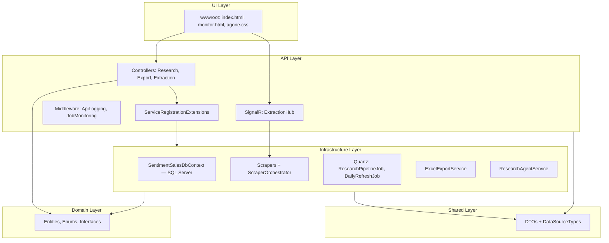
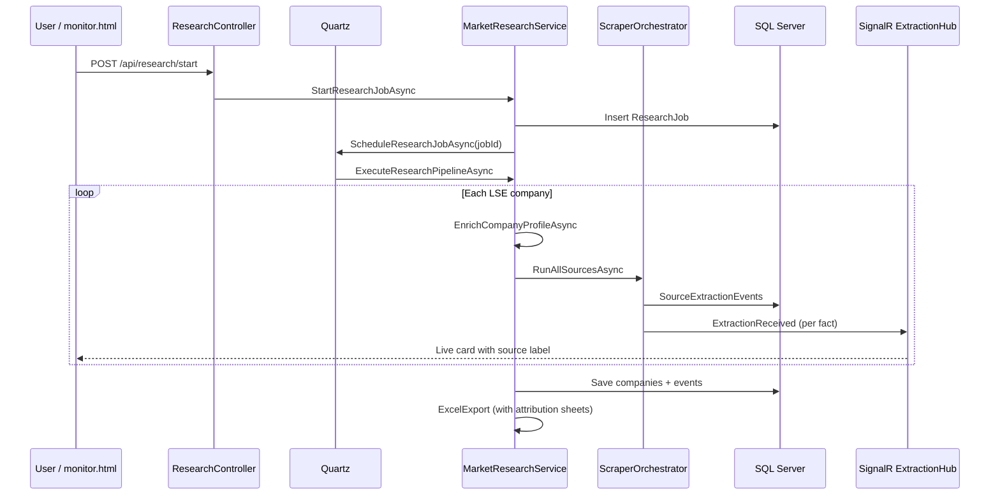
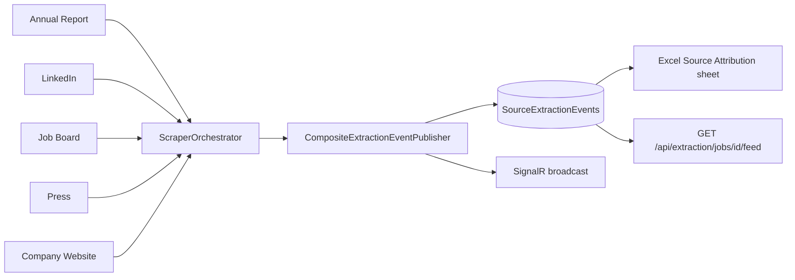

# Clean Architecture — System Flow

## Layer diagram

## End-to-end research + scrape flow

## Source attribution flow

## Quartz scheduling

| Job | Trigger | Action |
|-----|---------|--------|
| `ResearchPipelineJob` | On demand (per research start) | Full pipeline for one `jobId` |
| `DailyRefreshJob` | Cron `0 0 2 * * ?` | `StartResearchJobAsync(100)` |

## Excel workbook structure

1. LSE Dashboard Summary  
2. LSE Company Profiles  
3. LSE IT Budget Breakdown  
4. LSE Technology Strategy  
5. LSE Executive Contacts  
6. LSE Outsourcing Partners  
7. LSE Lead Generation Data  
8. **Source Attribution** (field-level provenance)  
9. **Source Summary Dashboard** (counts by channel)
