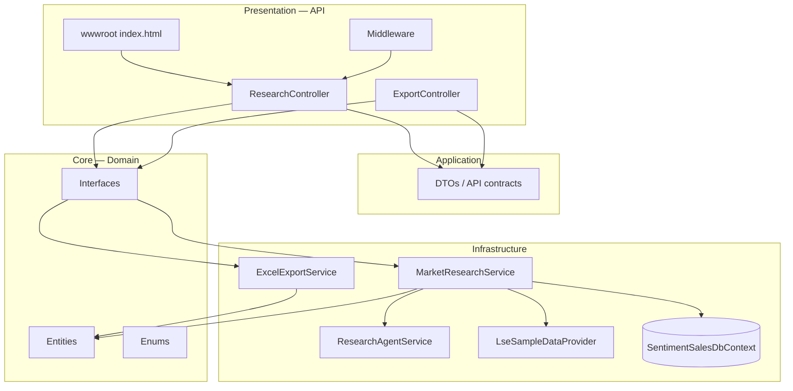
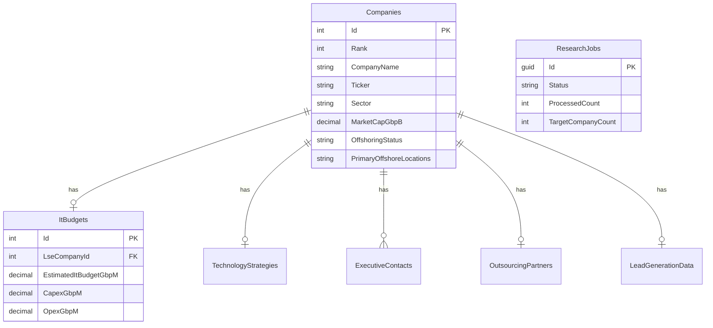
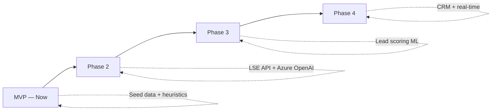

# AG ONE Sentiment Sales — Core Architecture

This document describes **how the system is structured**, **how components interact**, and **how data moves** from user action to SQL Server and Excel output.

---

## 1. Architectural principles

| Principle | Implementation |
|-----------|----------------|
| **Layered design (AG ONE)** | API → Application (DTOs) → Infrastructure → Core (no dependencies outward) |
| **Single startup project** | Only `AgoneSentimentSales.API` is executable |
| **Schema-isolated database** | All tables live under SQL Server schema `sentimentsales` |
| **Interface-driven services** | Core defines contracts; Infrastructure implements them |
| **Async research jobs** | Long-running enrichment runs in background with scoped `DbContext` |
| **Public-data MVP** | Seed list + heuristic agent; Phase 2 swaps in live APIs + Azure OpenAI |

---

## 2. Solution structure

```
AgoneSentimentSales/
├── Docs/                              ← Architecture, flows, PRD
├── docker-compose.yml                 ← Local SQL Server
├── scripts/update-database.sh         ← EF migrations CLI
└── Src/
    ├── AgoneSentimentSales.sln
    │
    ├── AgoneSentimentSales.API          ★ STARTUP PROJECT
    │   ├── Controllers/                HTTP API surface
    │   ├── Middleware/                 Logging, job headers
    │   ├── Extensions/                 DI registration
    │   ├── wwwroot/                    Static UI + agone.css
    │   └── Program.cs                  Migrate DB on startup
    │
    ├── AgoneSentimentSales.Application
    │   └── DTOs/                       Request/response models for API
    │
    ├── AgoneSentimentSales.Core
    │   ├── Entities/                   Domain model (EF entities)
    │   ├── Interfaces/                 Service contracts
    │   ├── Enums/                      OffshoringStatus, DigitalMaturity, …
    │   └── Monitoring/                 IJobTracker
    │
    └── AgoneSentimentSales.Infrastructure
        ├── Configuration/              OpenAI, Research settings
        ├── Data/                       SentimentSalesDbContext + migrations
        └── Services/                   Business & I/O implementations
```

### Layer responsibilities



---

## 3. Core domain model

The research output is centred on **`LseCompany`**. Related data is stored in child tables (1:1 or 1:many).



### SQL Server schema (`sentimentsales`)

| Table | Purpose |
|-------|---------|
| `sentimentsales.Companies` | Master company profile (LSE top 100) |
| `sentimentsales.ItBudgets` | IT spend breakdown (CapEx/OpEx, cloud, cyber, …) |
| `sentimentsales.TechnologyStrategies` | Digital maturity, AI, cloud, automation |
| `sentimentsales.ExecutiveContacts` | CIO, CDO, etc. |
| `sentimentsales.OutsourcingPartners` | TCS, Infosys, Accenture, … |
| `sentimentsales.LeadGenerationData` | Asia ops, hiring, pain points, lead score |
| `sentimentsales.ResearchJobs` | Async job tracking |
| `sentimentsales.ApiRequestLogs` | HTTP audit trail |
| `sentimentsales.__EFMigrationsHistory` | EF Core migrations |

---

## 4. Key services

| Interface | Implementation | Role |
|-----------|----------------|------|
| `IMarketResearchService` | `MarketResearchService` | Orchestrates jobs, queries, dashboard aggregates |
| `ICompanyDataProvider` | `LseSampleDataProvider` | Supplies top-N LSE companies (MVP seed data) |
| `IResearchAgentService` | `ResearchAgentService` | Enriches each company (budget, tech, contacts, leads) |
| `IExcelExportService` | `ExcelExportService` | Builds 7-sheet workbook (ClosedXML) |
| `IChatService` | `OpenAIChatService` | Azure OpenAI hook (Phase 2) |
| `IJobTracker` | `JobTracker` | In-memory progress for background jobs |

---

## 5. HTTP API surface

| Method | Endpoint | Action |
|--------|----------|--------|
| `POST` | `/api/research/start` | Start background research job |
| `GET` | `/api/research/jobs/{id}` | Poll job status |
| `GET` | `/api/research/companies` | List enriched companies |
| `GET` | `/api/research/dashboard` | Aggregated KPIs & sector breakdown |
| `GET` | `/api/export/excel` | Download `.xlsx` workbook |

Static UI at `/` uses the same endpoints via `fetch()`.

---

## 6. Middleware pipeline

```
HTTP Request
    │
    ▼
┌─────────────┐
│    CORS     │
└──────┬──────┘
       ▼
┌─────────────────────┐
│ ApiLoggingMiddleware │──► sentimentsales.ApiRequestLogs
└──────┬──────────────┘
       ▼
┌──────────────────────┐
│ JobMonitoringMiddleware │──► Header: X-Agone-Product: SentimentSales
└──────┬───────────────┘
       ▼
┌─────────────────┐
│   Controllers   │
└─────────────────┘
```

On application start (before accepting traffic):

```
Program.cs → db.Database.Migrate() → creates/updates sentimentsales.*
```

---

## 7. Dependency injection

Registered in `MonitoringExtensions.AddSentimentSalesServices()`:

| Service | Lifetime | Notes |
|---------|----------|-------|
| `SentimentSalesDbContext` | Scoped | SQL Server, schema `sentimentsales` |
| `IMarketResearchService` | Scoped | Uses `IServiceScopeFactory` for background work |
| `IExcelExportService` | Scoped | |
| `ICompanyDataProvider` | Scoped | |
| `IResearchAgentService` | Scoped | |
| `IChatService` | Scoped | |
| `IJobTracker` | Singleton | AsyncLocal progress context |

**Important:** Background jobs **must not** reuse the request-scoped `DbContext`. `MarketResearchService` creates a **new scope** via `IServiceScopeFactory` for `Task.Run` work.

---

## 8. Configuration

| Section | Class | Used by |
|---------|-------|---------|
| `ConnectionStrings:DefaultConnection` | — | EF Core SQL Server (**required**) |
| `OpenAI` | `OpenAISettings` | `OpenAIChatService` (Phase 2) |
| `AgoneSentimentSales` | `ResearchSettings` | Export path, default company count |

---

## 9. Excel output layer

`ExcelExportService` maps enriched entities to **7 worksheets** (KLSE-style layout, LSE/GBP):

1. LSE Dashboard Summary  
2. LSE Company Profiles  
3. LSE IT Budget Breakdown  
4. LSE Technology Strategy  
5. LSE Executive Contacts  
6. LSE Outsourcing Partners  
7. LSE Lead Generation Data  

Files are written to `exports/` and/or returned as `byte[]` for HTTP download.

---

## 10. Phase roadmap (architecture evolution)



| Phase | Architecture change |
|-------|---------------------|
| **MVP** | `LseSampleDataProvider`, `ResearchAgentService` heuristics, single API host |
| **Phase 2** | Replace data provider with market API; wire `IChatService` to Azure OpenAI prompts |
| **Phase 3** | Analytics service, predictive lead scoring, scheduled jobs (Azure Functions / Service Bus) |
| **Phase 4** | CRM connectors, webhooks, ONE Series SSO |

---

## 11. Related documents

| Document | Content |
|----------|---------|
| [SYSTEM_FLOW.md](./SYSTEM_FLOW.md) | Step-by-step flows with diagrams |
| [ARCHITECTURE.md](./ARCHITECTURE.md) | Short layer reference |
| [diagrams/AgoneSentimentSales-Full-Flow.drawio](./diagrams/AgoneSentimentSales-Full-Flow.drawio) | Draw.io: architecture + flows (open in diagrams.net) |
| [PRD.md](./PRD.md) | Product requirements |
| [PROJECT_PLAN.md](./PROJECT_PLAN.md) | Delivery plan |
