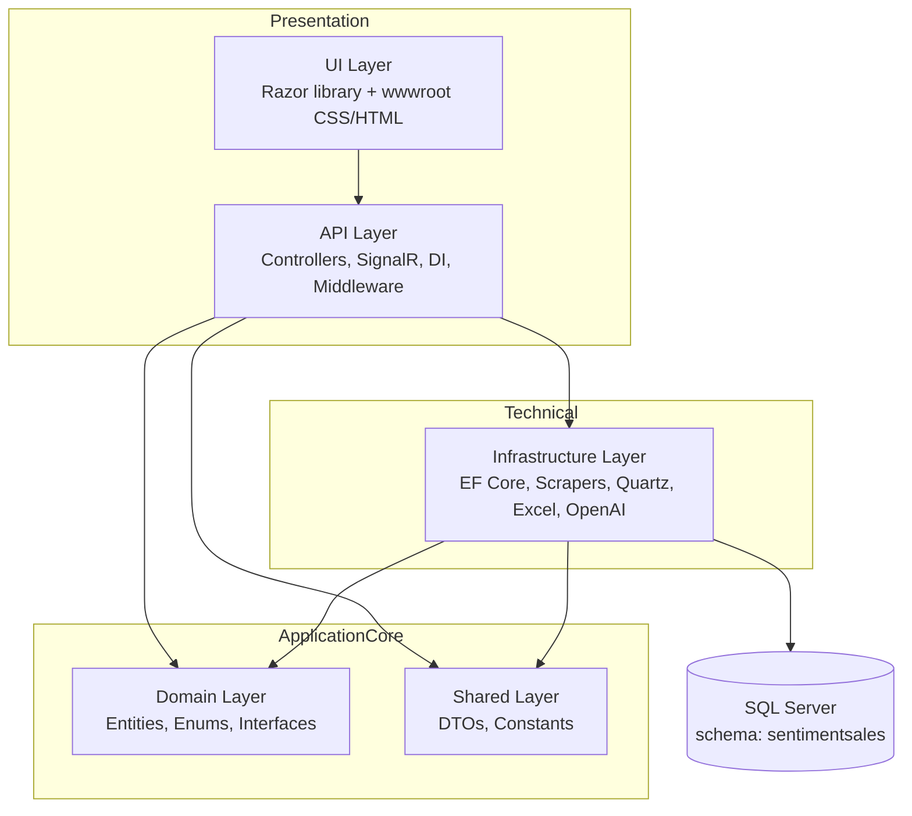
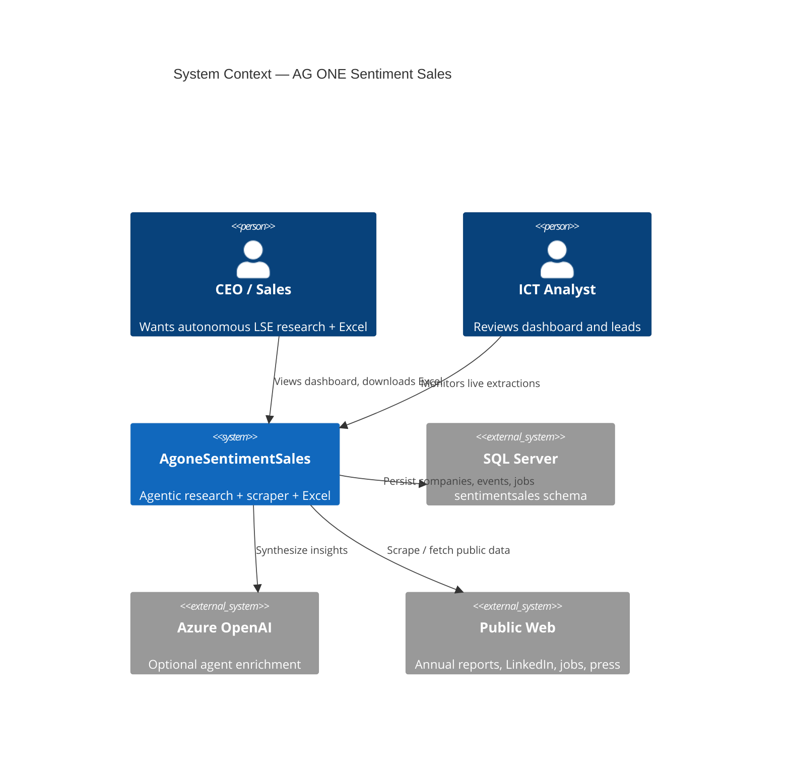
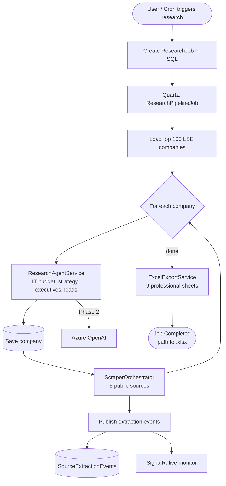
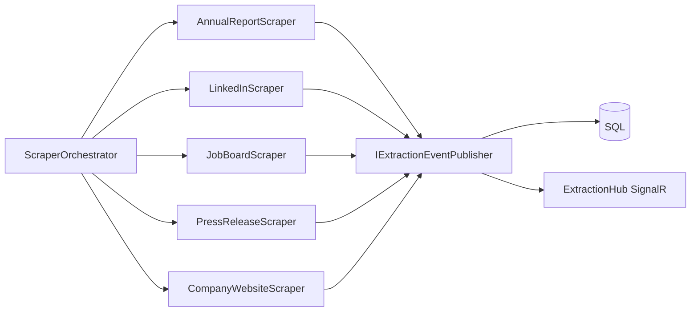
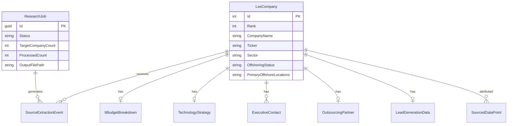
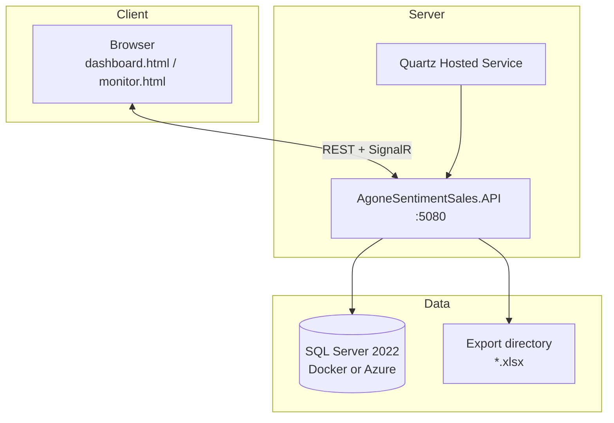

# AG ONE Sentiment Sales — System Design Document

**Version:** 1.0  
**Audience:** Executive stakeholders, product, engineering  
**Purpose:** Define the agentic LSE market-research system that autonomously scrapes public sources, builds a live dashboard, and exports CEO-grade Excel intelligence.

---

## 1. Executive summary

Your CEO requested an **agentic process** — a research bot that works on its own: discovers top LSE companies, confirms IT offshoring to India/Asia, profiles IT budgets and technology strategy, finds executive contacts, generates marketing leads, and delivers a **professional Excel workbook** plus a **real-time dashboard**.

**AgoneSentimentSales** implements that vision on a strict **five-layer clean architecture** with **SQL Server**, **Quartz** background scheduling, **multi-source scraper agents**, and **SignalR** live updates.

| Capability | Status |
|------------|--------|
| Top 100 LSE companies by market cap | Implemented (`LseSampleDataProvider`) |
| Offshoring confirmation + countries | Implemented (agent + scrapers) |
| Full IT budget breakdown (CEO categories) | Implemented (`ItBudgetBreakdown` + Excel sheet) |
| Technology strategy & digital maturity | Implemented |
| Executive contacts (CIO, CTO, CDO, etc.) | Implemented |
| Lead generation (partners, hiring, Asia ops) | Implemented |
| Public sources (reports, LinkedIn, jobs, press, web) | Implemented (MVP simulated extraction) |
| Real-time dashboard | `/dashboard.html` + SignalR progress |
| Live source monitor | `/monitor.html` + SignalR extractions |
| Professional Excel export | 9 sheets incl. source attribution |
| Azure OpenAI agent enrichment | Hook ready (`OpenAIChatService`) |

---

## 2. CEO research prompt → system mapping

The original analyst prompt is the **source of truth** for scope.

### 2.1 Company identification

| CEO requirement | System component | Storage |
|-----------------|------------------|---------|
| Top 100 LSE by market cap, by industry | `LseSampleDataProvider`, `ResearchAgentService` | `sentimentsales.Companies` |
| Confirm offshoring to India/Asia/other | Agent heuristics + `AnnualReportScraper`, `PressReleaseScraper` | `OffshoringStatus`, `PrimaryOffshoreLocations` |

### 2.2 IT budget breakdown

| CEO category | Entity field | Excel sheet |
|--------------|--------------|-------------|
| Total IT budget (latest FY) | `EstimatedItBudgetGbpM` | LSE IT Budget Breakdown |
| Capex vs Opex | `CapexGbpM`, `OpexGbpM` | Same |
| Offshore vs onshore resources | `OffshoreResourceCostGbpM`, `OnshoreResourceCostGbpM` | Same |
| Cloud (AWS/Azure/GCP) | `CloudInfrastructureGbpM` | Same |
| Application licensing | `ApplicationLicensingGbpM` | Same |
| App support & maintenance | `ApplicationSupportGbpM` | Same |
| Data & AI projects | `DataAndAiProjectsGbpM` | Same |
| End-user computing | `EndUserComputingGbpM` | Same |
| Cyber security | `CyberSecurityGbpM` | Same |
| Managed services / outsourcing | `ManagedServicesGbpM` | Same |
| Other | `OtherGbpM` | Same |

### 2.3 Technology strategy

| CEO requirement | Entity | Excel sheet |
|-----------------|--------|-------------|
| Data & AI programmes | `AiMlPrograms`, `DataAnalytics` | LSE Technology Strategy |
| Digital vs traditional IT | `DigitalMaturity`, `DigitalTransformationEvidence` | Same |
| Automation, analytics, AI | `AutomationFocus`, `KeyTechInitiatives` | Same |

### 2.4 Executive contacts

| Role | `ExecutiveRoleType` | Source |
|------|---------------------|--------|
| CIO / CTO | `Cio`, `Cto` | `LinkedInScraper` + agent |
| Chief Digital Officer | `ChiefDigitalOfficer` | LinkedIn |
| Head of IT Infrastructure | `HeadOfInfrastructure` | LinkedIn |
| VP Applications / Cloud | `VpApplications` | LinkedIn |

Stored in `sentimentsales.ExecutiveContacts` → **LSE Executive Contacts** sheet.

### 2.5 Lead generation

| CEO data point | Field / scraper | Excel sheet |
|----------------|-----------------|-------------|
| Asia subsidiary operations | `LeadGenerationData.AsiaOperations` | LSE Lead Generation Data |
| Outsourcing partners (TCS, Infosys, …) | `OutsourcingPartner` | LSE Outsourcing Partners |
| IT transformation announcements | `ItAnnouncements` ← press scraper | Lead Generation |
| Hiring trends | `HiringTrends` ← job board scraper | Lead Generation |

---

## 3. Clean architecture (five layers only)



### Project responsibilities

| Layer | Project | Must not contain |
|-------|---------|------------------|
| **API** | `AgoneSentimentSales.API` | Business rules, EF mappings |
| **UI** | `AgoneSentimentSales.UI` | Database access |
| **Infrastructure** | `AgoneSentimentSales.Infrastructure` | HTTP controllers |
| **Shared** | `AgoneSentimentSales.Shared` | Entities with behavior |
| **Domain** | `AgoneSentimentSales.Domain` | Framework references |

**Single startup project:** `AgoneSentimentSales.API`.

---

## 4. System context diagram



---

## 5. Agentic research process (core flow)

The **research agent** is not a single LLM call — it is an orchestrated pipeline:

1. **Scheduler** (Quartz) or user triggers `POST /api/research/start`
2. **Company loader** fetches top N LSE companies
3. **ICT analyst agent** (`ResearchAgentService`) enriches structured profile per company
4. **Scraper bots** (`ScraperOrchestrator`) query each public source and emit attributed facts
5. **Persistence** writes to SQL Server with full provenance
6. **Excel builder** produces the CEO workbook



### Real-time phases (SignalR `/hubs/research-progress`)

| Phase | User-visible message |
|-------|----------------------|
| `Initializing` | Agentic research job started |
| `LoadingCompanies` | Loading top LSE companies by market cap |
| `AgentEnrichment` | ICT analyst enriching IT budget, strategy, executives |
| `PublicSourceScraping` | Scraping annual reports, LinkedIn, job boards, press, websites |
| `Persisting` | Saving company N of total |
| `ExcelExport` | Building professional Excel workbook |
| `Completed` | File path to generated workbook |

---

## 6. Scraper agent architecture

Each public source is an independent **scraper agent** implementing `IDataSourceScraper`:



**Attribution model:** every fact is a `SourceExtractionEvent` with `SourceType`, `SourceLabel`, `SourceUrl`, `FieldName`, `ExtractedValue`, `ConfidenceScore`.

The **monitor UI** (`/monitor.html`) shows: *“This IT budget figure came from Annual Report — URL — 85% confidence.”*

---

## 7. Data model (logical)



All tables live under SQL schema **`sentimentsales`**.

---

## 8. Excel deliverable (CEO format)

| # | Sheet name | CEO prompt section |
|---|------------|-------------------|
| 1 | LSE Dashboard Summary | Executive KPIs, sector breakdown, partner rankings |
| 2 | LSE Company Profiles | Company ID, offshoring status, locations |
| 3 | LSE IT Budget Breakdown | Full cost taxonomy |
| 4 | LSE Technology Strategy | Digital maturity, AI, cloud |
| 5 | LSE Executive Contacts | Decision-makers |
| 6 | LSE Outsourcing Partners | TCS, Infosys, Accenture, etc. |
| 7 | LSE Lead Generation Data | Asia ops, hiring, announcements |
| 8 | Source Attribution | Field-level provenance (which source said what) |
| 9 | Source Summary Dashboard | Counts by channel, coverage by company |

Download: `GET /api/export/excel?jobId={guid}`

---

## 9. Deployment view



### Run locally

```bash
docker compose up -d sqlserver
cd Src
dotnet run --project AgoneSentimentSales.API --urls http://localhost:5080
```

| URL | Purpose |
|-----|---------|
| http://localhost:5080/dashboard.html | CEO real-time KPI dashboard |
| http://localhost:5080/monitor.html | Live scraper / source attribution |
| http://localhost:5080/swagger | REST API |
| http://localhost:5080/api/agent/scope | CEO prompt mapping (JSON) |
| http://localhost:5080/api/agent/pipeline | Agent phases (JSON) |

---

## 10. Scheduling (Quartz.NET)

| Job | Trigger | Behaviour |
|-----|---------|-----------|
| `ResearchPipelineJob` | Immediate on `POST /api/research/start` | Full agentic pipeline for one `jobId` |
| `DailyRefreshJob` | Cron `0 0 2 * * ?` (02:00 UTC daily) | `StartResearchJobAsync(100)` |

---

## 11. Security & compliance (public data)

- Scrapers must respect **robots.txt** and rate limits in production
- LinkedIn/email data: public profiles only; no credential scraping
- MVP uses **synthetic extractions** with realistic URLs for demo; Phase 2 wires HttpClient + HTML parsing + licensed APIs
- API keys (OpenAI) via `appsettings` / Azure Key Vault

---

## 12. Phase roadmap

| Phase | Focus |
|-------|--------|
| **MVP (current)** | Full architecture, simulated scrapers, heuristic agent, Excel + real-time UI |
| **Phase 2** | Azure OpenAI agent loops, real HTTP scraping, Companies House / LSE feeds |
| **Phase 3** | Licensed market data, email verification, CRM export |

---

## 13. Related documents

| Document | Content |
|----------|---------|
| [PRD.md](PRD.md) | Product requirements (CEO scope) |
| [ARCHITECTURE.md](ARCHITECTURE.md) | Layer quick reference |
| [CLEAN_ARCHITECTURE_FLOW.md](CLEAN_ARCHITECTURE_FLOW.md) | Mermaid sequence diagrams |
| [SYSTEM_FLOW.md](SYSTEM_FLOW.md) | Additional operational flows |
| [PROJECT_PLAN.md](PROJECT_PLAN.md) | Delivery phases |

---

## 14. API reference (agentic endpoints)

| Method | Path | Description |
|--------|------|-------------|
| POST | `/api/research/start` | Start autonomous research job |
| GET | `/api/research/jobs/{id}` | Job status + Excel path |
| GET | `/api/research/dashboard` | Aggregated KPIs |
| GET | `/api/extraction/jobs/{id}/feed` | Source-attributed facts |
| GET | `/api/export/excel` | Download workbook |
| GET | `/api/agent/scope` | CEO prompt → system mapping |
| GET | `/api/agent/pipeline` | Agent phase definitions |
| WS | `/hubs/research-progress` | Live job phases |
| WS | `/hubs/extraction` | Live scraper facts |

---

*This design document aligns with the CEO’s agentic scraper/research vision and the five-layer clean architecture (API, UI, Infrastructure, Shared, Domain).*
