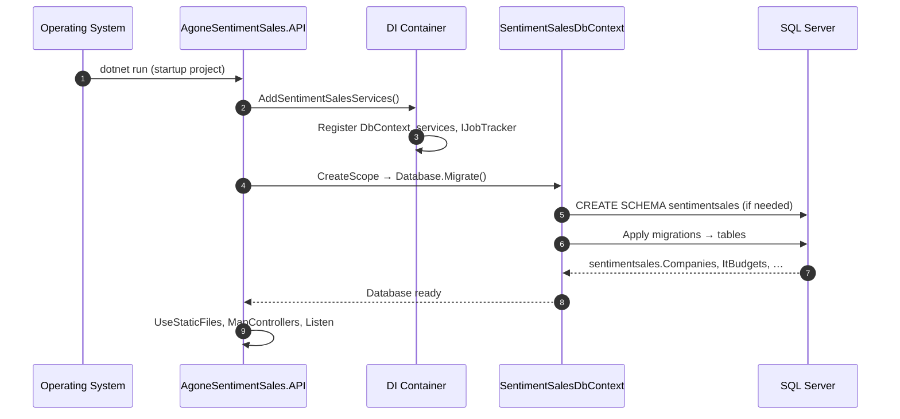
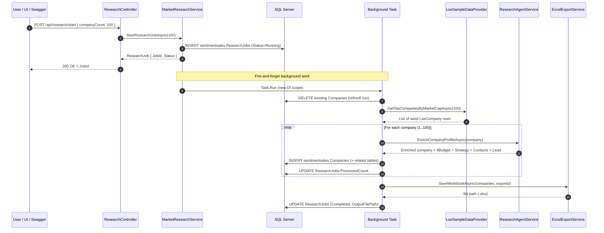
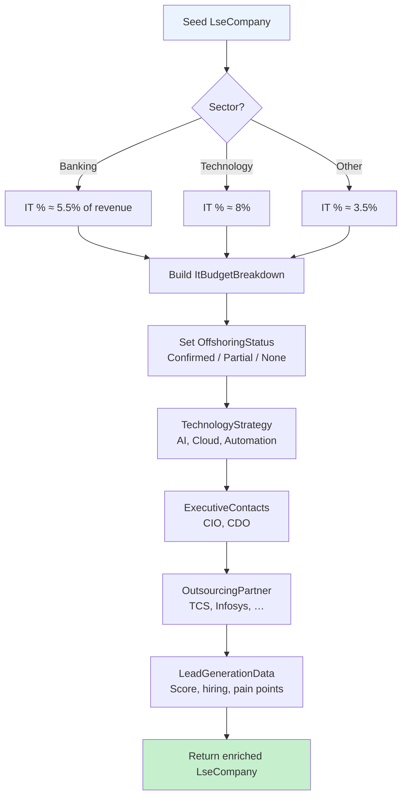
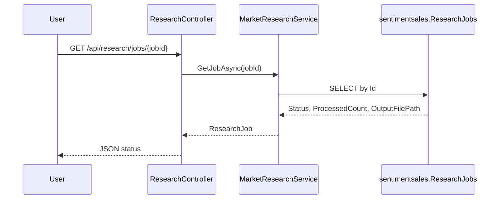
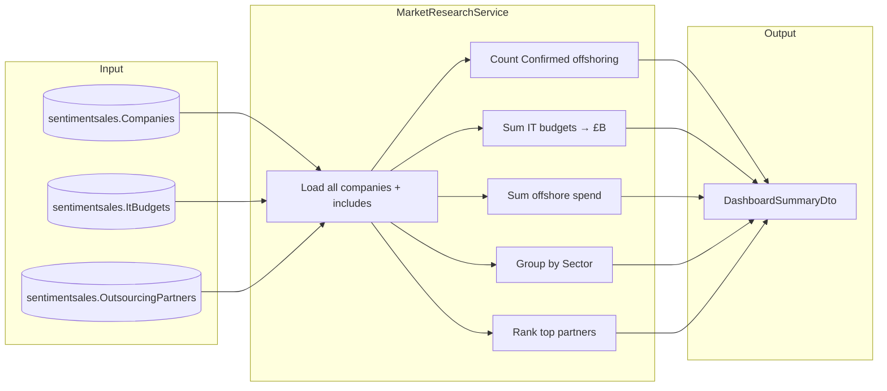
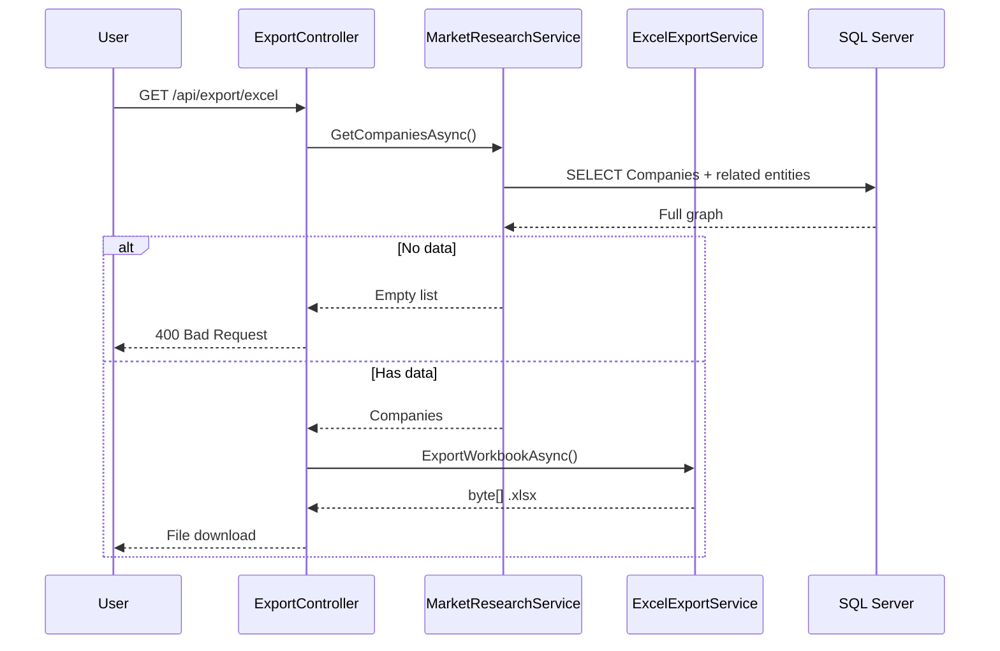
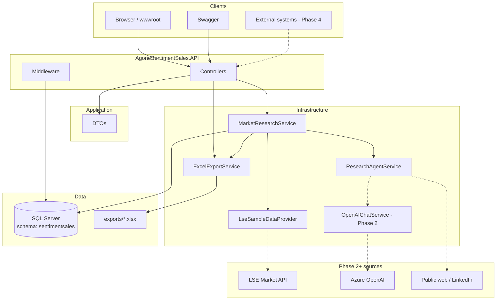

# AG ONE Sentiment Sales — System Flows

End-to-end flows for how the system works and how it is implemented.

---

## Flow 1 — Application startup



**Implementation:** `Program.cs` lines — `AddSentimentSalesServices`, scoped `Migrate()`, then `MapControllers()`.

---

## Flow 2 — Start research job (main business flow)

This is the **primary agentic research pipeline**.



### Step-by-step (implementation map)

| Step | What happens | Code location |
|------|----------------|---------------|
| 1 | HTTP POST received | `ResearchController.Start` |
| 2 | Job record created | `MarketResearchService.StartResearchJobAsync` |
| 3 | Response returned immediately | Job ID + `Running` status |
| 4 | New `IServiceScopeFactory` scope | Background `Task.Run` |
| 5 | Clear prior companies | `RunJobAsync` → `db.Companies.RemoveRange` |
| 6 | Load FTSE/LSE seed list | `LseSampleDataProvider` |
| 7 | Per-company enrichment | `ResearchAgentService.EnrichCompanyProfileAsync` |
| 8 | Persist relational data | EF Core → `sentimentsales.*` |
| 9 | Generate Excel | `ExcelExportService` → 7 sheets |
| 10 | Mark job complete | `ResearchJob.Status = Completed` |

---

## Flow 3 — Company enrichment (agent layer)



**MVP note:** `ResearchAgentService` uses deterministic heuristics keyed off ticker/sector. **Phase 2** replaces this with Azure OpenAI + external research sources via `IChatService`.

---

## Flow 4 — Poll job status



---

## Flow 5 — Dashboard aggregation



**API:** `GET /api/research/dashboard` → `ResearchController.Dashboard`.

---

## Flow 6 — Excel export (on-demand download)



**Note:** Research job also writes Excel to `exports/` folder during Flow 2.

---

## Flow 7 — Request logging

Every API call (after controller execution):

```
ApiLoggingMiddleware
  → INSERT sentimentsales.ApiRequestLogs
     (Method, Path, StatusCode, DurationMs, ClientIp)
```

Failures to save logs are non-blocking (swallowed).

---

## Flow 8 — Static UI (optional)

```mermaid
flowchart LR
    Browser[index.html + agone.css]
    Browser -->|POST /api/research/start| API
    Browser -->|GET /api/research/dashboard| API
    Browser -->|GET /api/export/excel| API
    Browser -->|/swagger| Swagger UI
```

**Files:** `wwwroot/index.html`, `wwwroot/css/agone.css`.

---

## Complete system context diagram



---

## Draw.io diagrams

For editable, presentation-ready diagrams open:

**[AgoneSentimentSales-Full-Flow.drawio](./diagrams/AgoneSentimentSales-Full-Flow.drawio)**

Pages included:

1. **Layered Architecture** — projects and dependencies  
2. **Research Job Flow** — full end-to-end sequence  
3. **Data & Database** — schema and relationships  
4. **API & Middleware** — request lifecycle  

Open at https://app.diagrams.net → File → Open from device.
