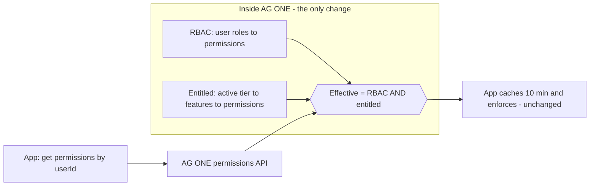

# AG ONE Runtime — adding the `Permission → Feature` layer

**Goal:** add subscription/feature gating to your existing distributed setup (AG ONE gateway + Hire / Work / Learn App Services sharing one DB) with **almost no change to the three apps**.

**Editable diagrams:** [`AGONE-Entitlement-Runtime-Flow.drawio`](AGONE-Entitlement-Runtime-Flow.drawio) — 5 pages:
1. Component / Deployment 2. Login & JWT 3. Permission fetch + Feature intersection 4. Data Flow Diagram 5. Process flow (Permission → Feature).

**Reference C#:** [`src/Subscriptions`](../src/Subscriptions) — the gateway aggregation lives in [`Gateway/GatewayEntitlementService.cs`](../src/Subscriptions/src/AgOne.Entitlements/Gateway/GatewayEntitlementService.cs) (tested).
**DB injection:** [`sql/003_inject_existing_core.sql`](../src/Subscriptions/sql/003_inject_existing_core.sql).

---

## 1. The key decision: gate at the source (AG ONE), not in every app

Today the flow is:

> app gets `userId` from JWT → calls AG ONE permissions service → AG ONE returns the user's **RBAC** permissions → app caches 10 min → app enforces.

Add the feature layer by making AG ONE return **effective** permissions instead of raw RBAC:

```
Returned permissions  =  RBAC permissions  ∩  permissions entitled by the tenant's subscription tier
```

Everything downstream — the JWT cookie, the 10-minute cache, the `[RequirePermission]` enforcement in Hire/Work/Learn — **stays exactly the same**. The list is simply already plan-aware. That is the whole "less effort" win.



---

## 2. Where each piece lives

| Concern | Where | Change? |
|---|---|---|
| Login, SSO, JWT issue | AG ONE | small: add `products[]`, `tier`, `ent_version` claims |
| Subscription + tier resolution | AG ONE | existing (`core.Subscriptions` + `core.ProductPlanTiers`) |
| `Permission → Feature` map | DB (`core.ProductFeaturePermissions`) | **1 new table** |
| Effective-permission computation | AG ONE permissions API | intersect RBAC ∩ entitlement |
| Fetch + 10-min cache + enforce | Hire / Work / Learn | **unchanged** (add optional version-based cache-bust) |

---

## 3. Step by step

### Login (diagram page 2)
1. Browser → AG ONE `/login` (SSO or password).
2. AG ONE validates via IdP (SSO) or password (non-SSO).
3. Resolve user + tenant (`core.Users`, `core.Tenants`).
4. Resolve active subscriptions + tier (`core.Subscriptions` → `core.ProductPlanTiers`).
5. Issue JWT with claims: `user_id`, `tenant_id`, `products[]`, per-product `tier`, `ent_version`.
6. Set JWT cookie/token on the browser.

### Using an app (diagram page 3)
1. Browser → Hire (JWT cookie).
2. Hire extracts `user_id`, `tenant_id`, `ent_version` from JWT.
3. Cache hit for `(user_id, ent_version)`? → enforce from cache.
4. Miss → Hire → AG ONE `GET /api/permissions/{userId}`.
5. AG ONE computes **RBAC** (existing).
6. **NEW:** AG ONE computes **entitled** permissions (tier → available features → `ProductFeaturePermissions` → permissions).
7. **NEW:** AG ONE returns **effective = RBAC ∩ entitled** (+ `ent_version`, `ttl`).
8. Hire caches (10 min) and enforces `[RequirePermission]` — unchanged.

---

## 4. C# — AG ONE gateway

### 4.1 Effective-permission service (reference, tested)
`GatewayEntitlementService` aggregates per product and returns the payload apps cache:

```csharp
public interface IGatewayEntitlementService
{
    Task<EffectivePermissionResponse> BuildAsync(
        Guid tenantId, Guid userId, IEnumerable<ProductKey> subscribedProducts,
        int cacheTtlSeconds = 600, CancellationToken ct = default);
}
```

It calls the engine's `AccessResolver.GetEffectivePermissionsAsync` (which is literally `RBAC ∩ entitled`) per product and unions the result. See [`GatewayEntitlementService.cs`](../src/Subscriptions/src/AgOne.Entitlements/Gateway/GatewayEntitlementService.cs).

### 4.2 Permissions endpoint (drop-in replacement for your current one)

```csharp
[ApiController]
[Route("api/permissions")]
public sealed class PermissionsController : ControllerBase
{
    private readonly IGatewayEntitlementService _gateway;
    public PermissionsController(IGatewayEntitlementService gateway) => _gateway = gateway;

    // Called by Hire/Work/Learn exactly as today — response shape is a superset.
    [HttpGet("{userId:guid}")]
    public async Task<ActionResult<EffectivePermissionResponse>> Get(Guid userId, CancellationToken ct)
    {
        var tenantId = Guid.Parse(User.FindFirstValue("tenant_id")!);
        var products = User.FindAll("product")               // products the tenant is subscribed to
            .Select(c => Enum.Parse<ProductKey>(c.Value, true));

        var result = await _gateway.BuildAsync(tenantId, userId, products, cacheTtlSeconds: 600, ct);
        return Ok(result);
    }
}
```

### 4.3 Enrich the JWT at login

```csharp
var products = await _subscriptions.GetActiveProductsAsync(tenantId); // from core.Subscriptions
var claims = new List<Claim>
{
    new("user_id", user.Id.ToString()),
    new("tenant_id", tenantId.ToString()),
    new("ent_version", await _gateway.ComputeEntitlementVersionAsync(tenantId)) // bust caches on plan change
};
foreach (var p in products)
{
    claims.Add(new Claim("product", p.ProductCode));      // "hire" | "learn" | "work"
    claims.Add(new Claim($"tier:{p.ProductCode}", p.PlanTier)); // "Standard" ...
}
// ... sign JWT as you do today
```

### 4.4 DI (AG ONE)

```csharp
builder.Services.AddAgOneEntitlements();                              // engine + gateway service
builder.Services.AddScoped<IUserPermissionProvider, EfUserPermissionProvider>(); // core.* RBAC
builder.Services.AddScoped<ISubscriptionStore,     EfSubscriptionStore>();        // core.Subscriptions
builder.Services.AddScoped<ICatalogProvider,       EfCatalogProvider>();          // core.ProductFeatures + bridge
```

---

## 5. C# — the three apps (Hire / Work / Learn)

Minimal change: they already fetch + cache + enforce. Keep it; just key the cache by `ent_version` so a plan change refreshes before the 10 minutes elapse.

```csharp
public sealed class AgOnePermissionClient
{
    private readonly HttpClient _http;
    private readonly IMemoryCache _cache;
    public AgOnePermissionClient(HttpClient http, IMemoryCache cache) { _http = http; _cache = cache; }

    public async Task<ISet<string>> GetPermissionsAsync(Guid userId, string entVersion, CancellationToken ct)
    {
        var key = $"perms:{userId:N}:{entVersion}";           // version in the key = automatic bust
        if (_cache.TryGetValue(key, out ISet<string>? cached)) return cached!;

        var res = await _http.GetFromJsonAsync<EffectivePermissionResponse>($"api/permissions/{userId}", ct);
        var set = res!.AllPermissionCodes.ToHashSet(StringComparer.OrdinalIgnoreCase);

        _cache.Set(key, set, TimeSpan.FromSeconds(res.CacheTtlSeconds)); // your existing 10 min
        return set;
    }
}
```

Enforcement stays as you have it (attribute/handler that checks the cached set). Because the set is already plan-filtered by AG ONE, a user on a lower tier simply won't have the gated permission and the existing check returns 403/redirects to upsell.

---

## 6. Cache invalidation on plan change

```mermaid
sequenceDiagram
    participant Pay as Payment provider
    participant AG as AG ONE webhook
    participant DB as core.Subscriptions
    Pay->>AG: subscription.updated / invoice.paid
    AG->>DB: update tier / status
    AG->>AG: bump entitlement version for tenant
    Note over AG: next login (or next token refresh) carries new ent_version;<br/>apps' cache keys change → they refetch effective permissions
```

Because the app cache key contains `ent_version`, you don't need to reach into each app — changing the version naturally invalidates all of them. (For instant effect without waiting for token refresh, also expose a lightweight `GET /api/entitlement-version/{tenantId}` the apps check, or push a signal.)

---

## 7. Rollout safety — baseline vs strict

Two policies for permissions **not yet mapped** to any feature (see process-flow page 5):

- **Baseline (recommended for rollout):** an unmapped permission stays ungated — nothing breaks. Only permissions you deliberately map to a premium feature get gated. Effective set =

  ```sql
  -- RBAC permissions that are EITHER not gated OR entitled by the tier
  SELECT p.Id, p.Code
  FROM core.UserRoles ur
  JOIN core.RolePermissions rp ON rp.RoleId = ur.RoleId AND rp.IsDeleted = 0
  JOIN core.Permissions p ON p.Id = rp.PermissionId AND p.IsDeleted = 0
  WHERE ur.UserId = @UserId AND ur.TenantId = @TenantId AND ur.IsDeleted = 0
    AND (
         NOT EXISTS (SELECT 1 FROM core.ProductFeaturePermissions fpp
                     WHERE fpp.PermissionId = p.Id AND fpp.IsDeleted = 0)          -- ungated baseline
         OR EXISTS (SELECT 1 FROM core.vTenantEntitledPermissions ep
                    WHERE ep.PermissionId = p.Id AND ep.TenantId = @TenantId)      -- gated AND entitled
    );
  ```

- **Strict (target state):** deny-by-default — a permission is effective only if it is entitled by the tier. This is exactly `core.fnEffectivePermissions` in [`003_inject_existing_core.sql`](../src/Subscriptions/sql/003_inject_existing_core.sql). Switch to this once every premium permission is mapped.

Start baseline, map features incrementally, then flip to strict.

---

## 8. Why this is low-effort

- **One new table** (`core.ProductFeaturePermissions`) + optional tier column on `core.Subscriptions`.
- **One service change** in AG ONE (return effective instead of raw RBAC).
- **Zero change** to Hire/Work/Learn enforcement (optional 1-line cache-key tweak).
- Reuses your existing SSO, JWT, permissions API, and 10-minute cache untouched.
