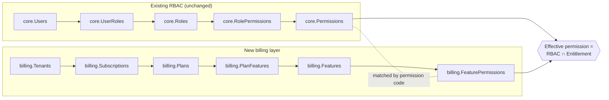
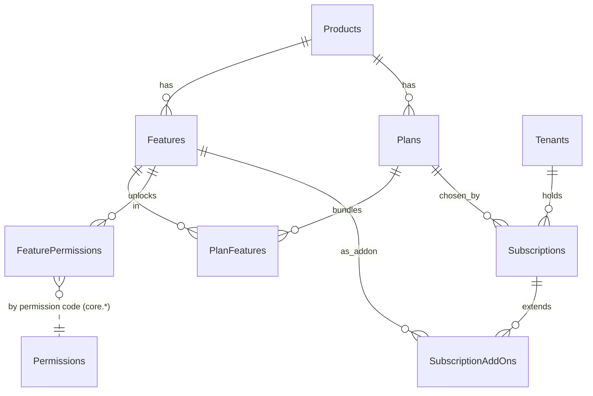
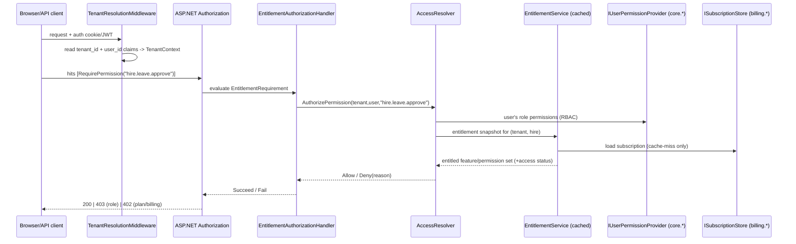
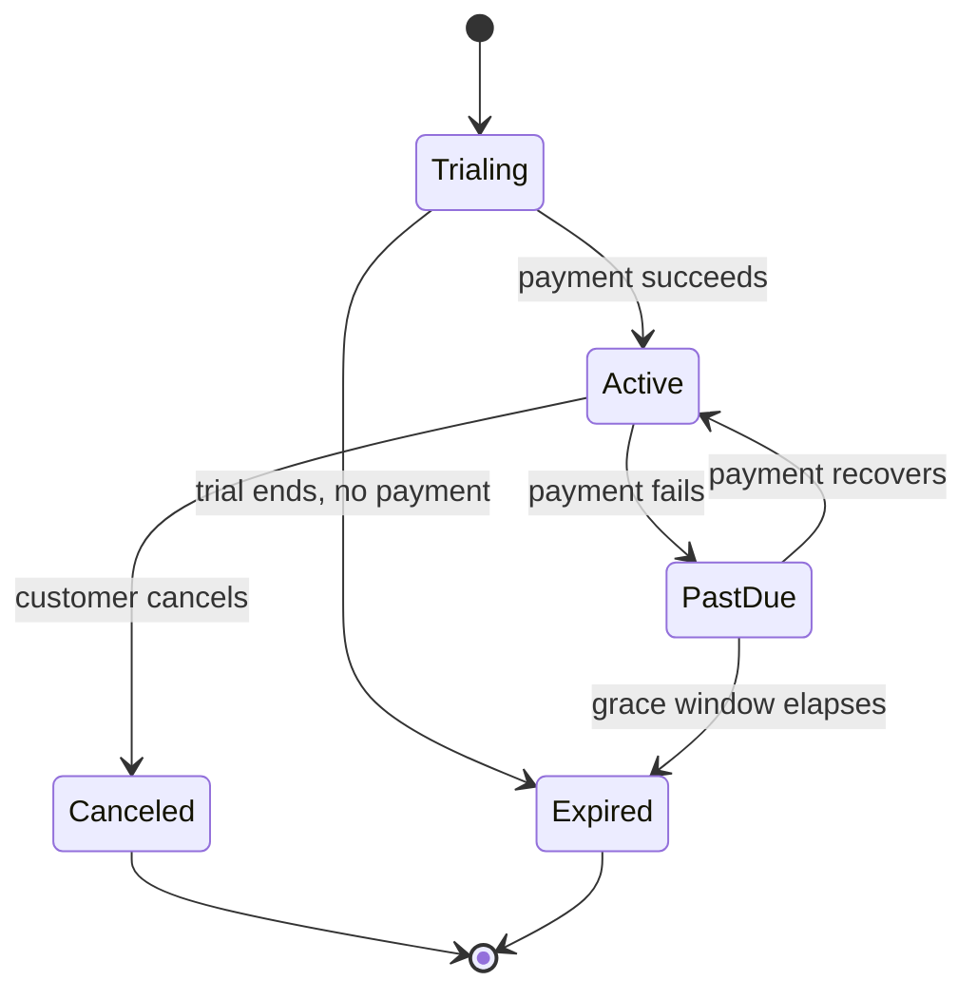
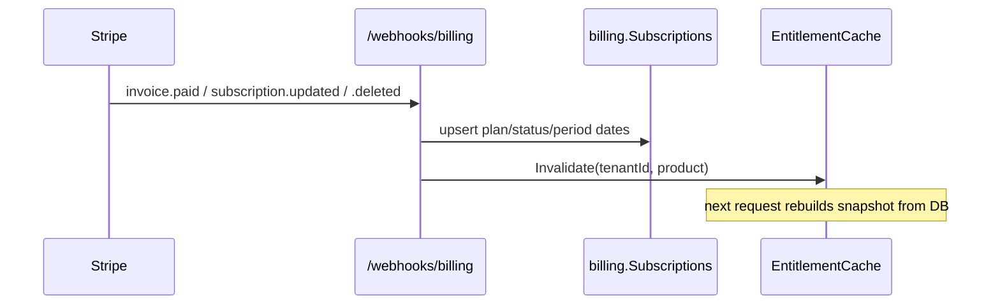

# Subscription & Entitlement Architecture (AG ONE: Hire · Learn · Work)

**Status:** Design + reference implementation
**Scope:** Add per-tenant subscription plans (Starter / Lite / Standard / Enterprise) on top of the **existing** RBAC (`core.Permissions`, `core.Roles`, `core.Users`) with the least possible change to what you already built, and make it reusable across all three products (`hire.*`, `learn.*`, `work.*`).
**Reference code:** [`src/Subscriptions`](../src/Subscriptions) · **SQL:** [`src/Subscriptions/sql`](../src/Subscriptions/sql) · **Editable diagram:** [`Subscription-Entitlement-Architecture.drawio`](Subscription-Entitlement-Architecture.drawio) (open in [draw.io / diagrams.net](https://app.diagrams.net) — 3 pages: Solution Architecture, Data Model ERD, Authorization Decision)

---

## 1. The one idea that makes this cheap

You already have **RBAC**: *"can this **user** (through their role) do X?"*
Subscriptions add a second, **orthogonal** question: *"is X **included in the plan** the customer paid for?"*

> **Effective access = RBAC permission **AND** plan entitlement.**

Both questions are answered in terms of the **same permission codes you already have**. The only new artefact you need is a small mapping table that says *"feature F unlocks permissions P1, P2…"*. That table (`billing.FeaturePermissions`) is the entire bridge. Nothing about your roles, role-permission assignments, or existing `[Authorize]`/permission checks has to change — you only **intersect** their result with the plan's entitled set.



Because the join key is the **permission code**, the two systems are wired together without touching either side's tables.

---

## 2. Concepts and vocabulary

| Concept | Meaning | Example |
|---|---|---|
| **Product** | One of your apps / DB schemas | `hire`, `learn`, `work` |
| **Permission** *(existing)* | Atomic action already in `core.Permissions` | `hire.employee.write` |
| **Feature** *(new)* | A sellable capability shown on the pricing page | *Document Management* |
| **Feature→Permission map** *(new)* | Which permissions a feature unlocks | `hire.document_management → hire.document.read, hire.document.write` |
| **Plan** *(new)* | A commercial tier bundling features, per product | `hire.standard` |
| **Tenant** *(new)* | A paying customer organisation | *Contoso Ltd* |
| **Subscription** *(new)* | A tenant's plan for one product, with lifecycle | *Contoso → hire.standard, Active* |
| **Add-on** *(new)* | Extra feature sold on top of a plan | *+ Geofencing* |
| **Entitlement snapshot** *(new)* | Cached "what this tenant can use right now" | set of feature keys + permission codes |

**Naming convention (important):** permission codes are `"<product>.<resource>.<action>"` (e.g. `hire.leave.approve`). The engine reads the prefix to know which product's subscription to check. If your existing codes differ, either adopt this convention or adjust `AccessResolver.ResolveProduct` (one method).

---

## 3. Data model

New objects live in a **`billing`** schema. `core.*` is untouched.



| Table | Purpose |
|---|---|
| `billing.Products` | `hire`/`learn`/`work` (+ `platform`) |
| `billing.Features` | catalog of capabilities, `IsComingSoon` flag |
| `billing.FeaturePermissions` | **the bridge** — feature → existing permission codes |
| `billing.Plans` | tiers per product (`Tier`: 10/20/30/40) |
| `billing.PlanFeatures` | features included in each plan |
| `billing.Tenants` | customers |
| `billing.Subscriptions` | tenant × product → plan + status + dates + grace |
| `billing.SubscriptionAddOns` | per-subscription extra features |

Full DDL: [`sql/001_billing_schema.sql`](../src/Subscriptions/sql/001_billing_schema.sql). Seed matching the code catalog: [`sql/002_seed_catalog.sql`](../src/Subscriptions/sql/002_seed_catalog.sql).

### 3.1 Computing effective access in pure SQL

Two objects ship in the DDL so reports/back-office can answer the same question the app does:

- `billing.vEntitledPermissions(TenantId, ProductId, PermissionCode)` — permissions currently entitled by a tenant's **active** subscription (honours trial end, period end, and past-due **grace window**, and excludes *Coming Soon*).
- `billing.fnEffectivePermissions(@TenantId, @UserId)` — `RBAC ∩ entitlement` for a specific user:

```sql
SELECT DISTINCT p.Code
FROM core.UserRoles ur
JOIN core.RolePermissions rp ON rp.RoleId = ur.RoleId
JOIN core.Permissions p      ON p.PermissionId = rp.PermissionId
JOIN billing.vEntitledPermissions ep
     ON ep.PermissionCode = p.Code AND ep.TenantId = @TenantId
WHERE ur.UserId = @UserId;
```

---

## 4. Plan × Feature matrix (from your pricing)

Hire (HR) tiers are **cumulative** — each tier includes everything below it plus its own additions. This is exactly what the reference catalog and seed encode.

| Feature (Hire) | Starter · *Essential HR* | Lite · *Core HR & Ops* | Standard · *Full HR Ops* | Enterprise · *Scale Org* |
|---|:--:|:--:|:--:|:--:|
| Employee Master Data (records, demographics, contacts) | ✅ | ✅ | ✅ | ✅ |
| Personal Profile Management | ✅ | ✅ | ✅ | ✅ |
| Personalized Home | ✅ | ✅ | ✅ | ✅ |
| Data Import (CSV/Excel) | ✅ | ✅ | ✅ | ✅ |
| Employment History (job history, transfers, promotions) | | ✅ | ✅ | ✅ |
| Document Management | | ✅ | ✅ | ✅ |
| Punch Clock / Time Entry | | ✅ | ✅ | ✅ |
| Leave Request Workflow | | ✅ | ✅ | ✅ |
| Push Notifications | | ✅ | ✅ | ✅ |
| Org Chart Visualization | | | ✅ | ✅ |
| Geofencing / GPS Tracking | | | ✅ | ✅ |
| Leave Balance Tracking | | | ✅ | ✅ |
| Leave Calendar View | | | ✅ | ✅ |
| Onboarding Workflows | | | ✅ | ✅ |
| Social Learning | | | ✅ | ✅ |
| REST API | | | ✅ | ✅ |
| Microsoft 365 Integration | | | ✅ | ✅ |
| Preboarding Portal | | | | ✅ |
| Webhooks | | | | ✅ |
| SSO / SAML | | | | ✅ |
| SCIM Provisioning | | | | ✅ |
| ISO 27001 | | | | ✅ |
| SOC 2 Type 2 | | | | ✅ |
| Agentic AI Assistant / Chatbot | 🕓 Coming Soon | 🕓 | 🕓 | 🕓 |
| AI-Native Architecture | 🕓 Coming Soon | 🕓 | 🕓 | 🕓 |

> *Coming Soon* features are present in the catalog and pricing page but **never** entitle access (enforced in code and SQL) until you flip `IsComingSoon = 0`.

`learn` and `work` reuse the identical engine with their own catalogs (see [`Catalog/PlanCatalog.cs`](../src/Subscriptions/src/AgOne.Entitlements/Catalog/PlanCatalog.cs)).

---

## 5. Runtime architecture

### 5.1 Solution layout

```
src/Subscriptions/
├─ src/
│  ├─ AgOne.Entitlements/            # pure engine, no ASP.NET dependency (reusable everywhere)
│  │  ├─ Domain/                     # Feature, Plan, Subscription, EntitlementSnapshot, enums
│  │  ├─ Abstractions/               # IClock, ICatalogProvider, ISubscriptionStore, IUserPermissionProvider
│  │  ├─ Services/                   # EntitlementService, AccessResolver
│  │  └─ Catalog/                    # PlanCatalog (source of truth) + FeatureKeys / PlanKeys
│  └─ AgOne.Entitlements.AspNetCore/ # attributes, policy provider, handler, tenant middleware, caching, DI
└─ tests/AgOne.Entitlements.Tests/   # xUnit — 16 tests
```

The **engine is a plain class library** so all three apps reference the same NuGet/project. Each app only implements two tiny adapters over its own DB.

### 5.2 Request flow



### 5.3 The decision, in full

`AccessResolver.AuthorizePermissionAsync` returns one of:

| Outcome | Meaning | Suggested HTTP | UX |
|---|---|---|---|
| `Allow` | role grants **and** plan includes **and** subscription active | `200` | proceed |
| `Deny(SubscriptionInactive)` | expired / cancelled / past grace | `402` | "Renew to continue" |
| `Deny(NotPermittedByRole)` | plan includes it, role doesn't | `403` | "Ask your admin" |
| `Deny(NotIncludedInPlan)` | role grants it, plan doesn't | `402` | **Upsell**: "Upgrade to Standard" |

Splitting *"you can't"* (403) from *"your plan can't"* (402) is what turns a wall into an upsell.

---

## 6. Enforcement points (defense in depth)

Gate at every layer; the entitlement check is cheap because it reads a cached snapshot.

**1. Controller / endpoint** — drop-in attributes:

```csharp
// Combined RBAC + entitlement (replaces a role-only attribute 1:1)
[RequirePermission("hire.leave.approve")]
public IActionResult Approve(int id) { ... }

// Pure feature gate for a whole module
[RequireFeature(FeatureKeys.DocumentManagement)]
public class DocumentsController : Controller { ... }
```

These work with **zero named-policy registration** thanks to `EntitlementPolicyProvider`, which manufactures a policy from the `perm:`/`feat:` prefix on demand.

**2. Service layer** — imperative check for business logic:

```csharp
var decision = await _access.AuthorizePermissionAsync(tenantId, userId, "hire.document.write");
if (!decision.Allowed) throw new EntitlementException(decision.Reason);
```

**3. UI / navigation** — hide what isn't bought:

```cshtml
@if (await Entitlements.HasFeatureAsync(tenant.TenantId, FeatureKeys.OrgChart))
{
    <a asp-controller="OrgChart">Org Chart</a>
}
```

**4. Data layer (optional hard stop)** — for the strictest tenants, the `billing.fnEffectivePermissions` function / `vEntitledPermissions` view let you filter or assert at query time.

---

## 7. Wiring it into an app (Program.cs)

```csharp
builder.Services.AddAgOneEntitlements();               // engine + policies + handler + cache

// The only app-specific glue: adapters over YOUR existing tables.
builder.Services.AddScoped<IUserPermissionProvider, EfUserPermissionProvider>(); // reads core.*
builder.Services.AddScoped<ISubscriptionStore,     EfSubscriptionStore>();        // reads billing.*

var app = builder.Build();
app.UseAuthentication();
app.UseAgOneTenantResolution();   // fills TenantContext from claims (after auth)
app.UseAuthorization();
```

### 7.1 Adapter over the existing RBAC (reuses your permissions verbatim)

```csharp
public sealed class EfUserPermissionProvider : IUserPermissionProvider
{
    private readonly CoreDbContext _db;
    public EfUserPermissionProvider(CoreDbContext db) => _db = db;

    public async Task<IReadOnlySet<string>> GetPermissionCodesAsync(Guid userId, CancellationToken ct = default)
    {
        var codes = await (
            from ur in _db.UserRoles
            where ur.UserId == userId
            join rp in _db.RolePermissions on ur.RoleId equals rp.RoleId
            join p  in _db.Permissions    on rp.PermissionId equals p.PermissionId
            select p.Code).Distinct().ToListAsync(ct);
        return codes.ToHashSet(StringComparer.OrdinalIgnoreCase);
    }
}
```

That's the whole integration with your current system — **you keep every existing role, assignment and permission**; the engine just intersects with the plan.

### 7.2 Adapter over billing

```csharp
public sealed class EfSubscriptionStore : ISubscriptionStore
{
    private readonly BillingDbContext _db;
    public EfSubscriptionStore(BillingDbContext db) => _db = db;

    public async Task<Subscription?> GetAsync(Guid tenantId, ProductKey product, CancellationToken ct = default)
    {
        var row = await _db.Subscriptions.Include(s => s.Plan).Include(s => s.AddOns)
            .SingleOrDefaultAsync(s => s.TenantId == tenantId && s.ProductId == (int)product, ct);
        return row is null ? null : Map(row); // -> Domain.Subscription
    }
}
```

---

## 8. Multi-product story (Hire, Learn, Work)

- **One engine, three catalogs.** `PlanCatalog` holds features/plans for all products; each app resolves only its own product from the permission prefix, so a `learn.*` permission never consults a `hire` subscription (proven by the *product isolation* test).
- **Independent subscriptions.** A tenant can be `hire.enterprise` + `learn.standard` + `work.starter` simultaneously; `billing.Subscriptions` is unique per `(TenantId, ProductId)`.
- **Shared cross-cutting capabilities** (REST API, SSO, Webhooks…) are modelled *per product* here (e.g. `hire.rest_api`, `learn.rest_api`) so ownership stays unambiguous. If you prefer truly tenant-wide platform entitlements, use the `Platform` product enum and give the tenant a `platform` subscription — the engine already supports it.

---

## 9. Subscription lifecycle



Access-granting rule (`EntitlementService.EvaluateAccess`):

| Status | Grants access while… |
|---|---|
| `Trialing` | `now ≤ TrialEndUtc` |
| `Active` | `now ≤ CurrentPeriodEndUtc` (or open-ended) |
| `PastDue` | `now ≤ CurrentPeriodEndUtc + GracePeriod` |
| `Canceled` / `Expired` | never |

**Upgrade/downgrade** = change `PlanId` and invalidate the cached snapshot; entitled set recomputes on next request. **Add-ons** = rows in `SubscriptionAddOns`, entitled exactly like plan features.

---

## 10. Billing integration & cache invalidation



Snapshots are cached per `(tenant, product)` for a short TTL (default 5 min) via `CachingEntitlementService`; call `Invalidate(...)` from the webhook handler for instant effect. Failing to invalidate only delays a change by one TTL — never grants more than paid for beyond that window.

---

## 11. Performance

- Hot path (every authorization) touches **only the in-memory snapshot** — no DB round-trip on cache hit.
- Snapshot build is a couple of indexed reads; expansion is set unions over small collections.
- RBAC permission set per user can be cached the same way (or via claims baked at login).
- The engine is allocation-light and fully `async`.

---

## 12. Rollout / migration strategy (low-risk, incremental)

1. **Ship schema + seed** (`001`, `002`). No behavior change yet.
2. **Backfill tenants & subscriptions.** Give every current customer an appropriate plan (e.g. grandfather everyone to `*.enterprise` initially) so nobody loses access on day one.
3. **Deploy the library in shadow / fail-open mode.** Log `NotIncludedInPlan` denials without enforcing; compare against expectations. (Add a feature flag around `context.Fail(...)`.)
4. **Flip to enforce**, product by product, tenant cohort by cohort.
5. **Turn on upsell UX** (402 → upgrade page) once enforcement is trusted.
6. **Author the true commercial matrix** and downgrade grandfathered tenants per contract.

Default posture is **deny-by-default** (no subscription ⇒ no access); use fail-open only during the shadow phase.

---

## 13. Security considerations

- **Deny-by-default & defense in depth** — gate at controller, service, and (optionally) data layers; never rely on hidden UI alone.
- **Tenant isolation** — every check is scoped to `TenantContext.TenantId` sourced from the authenticated principal, not from request input.
- **No privilege escalation via billing** — the plan can only ever *remove* permissions the role already grants (intersection), never add new ones.
- **Coming-Soon safety** — such features are dropped during snapshot build, so an accidental plan mapping can't leak an unreleased capability.
- **Auditing** — log every `Deny` with reason + tenant + user + permission for support and abuse detection.

---

## 14. Testing & evidence

`AgOne.Entitlements.Tests` (xUnit, 16 tests) proves the core guarantees with an in-memory catalog, subscription store, RBAC provider, and a controllable clock:

- Effective access is exactly `RBAC ∩ entitlement` (allow / upsell / forbidden cases).
- Plan gating: Standard entitles Org Chart, Starter doesn't; tiers are strictly cumulative.
- *Coming Soon* never entitles even on Enterprise.
- Lifecycle: trial expiry, and past-due **inside vs. outside** the grace window.
- Product isolation: a `learn` subscription never unlocks `hire` permissions.
- Add-ons add their permissions on top of the plan.

Run:

```bash
cd src/Subscriptions
dotnet test
```

---

## 15. Extensibility (future)

- **Usage limits / quotas** (e.g. max employees, storage GB) — add `billing.PlanLimits(PlanId, Metric, Limit)` and a `IQuotaService`; check alongside entitlement.
- **Seat-based licensing** — add active-seat counting per subscription.
- **Per-tenant feature overrides / betas** — reuse `SubscriptionAddOns` or a `TenantFeatureFlags` table.
- **Metered billing** — emit usage events on entitled actions.

---

## 16. Appendix — file map

| Path | What |
|---|---|
| [`src/Subscriptions/src/AgOne.Entitlements`](../src/Subscriptions/src/AgOne.Entitlements) | Pure entitlement engine |
| [`.../Services/AccessResolver.cs`](../src/Subscriptions/src/AgOne.Entitlements/Services/AccessResolver.cs) | `RBAC ∩ entitlement` decision |
| [`.../Services/EntitlementService.cs`](../src/Subscriptions/src/AgOne.Entitlements/Services/EntitlementService.cs) | Snapshot + lifecycle rules |
| [`.../Catalog/PlanCatalog.cs`](../src/Subscriptions/src/AgOne.Entitlements/Catalog/PlanCatalog.cs) | Source-of-truth catalog (all 3 products) |
| [`src/Subscriptions/src/AgOne.Entitlements.AspNetCore`](../src/Subscriptions/src/AgOne.Entitlements.AspNetCore) | Attributes, policy provider, handler, tenant middleware, caching, DI |
| [`src/Subscriptions/sql/001_billing_schema.sql`](../src/Subscriptions/sql/001_billing_schema.sql) | `billing` schema + views/functions |
| [`src/Subscriptions/sql/002_seed_catalog.sql`](../src/Subscriptions/sql/002_seed_catalog.sql) | Catalog seed mirroring the code |
| [`src/Subscriptions/tests/AgOne.Entitlements.Tests`](../src/Subscriptions/tests/AgOne.Entitlements.Tests) | xUnit tests |
